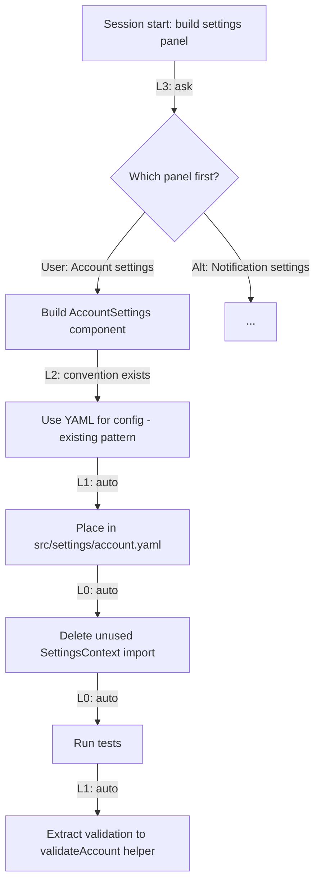

# Decision Authority Levels for AI Agents

The agent asked me whether it should delete an unused import.

I had 14 other things open. The question sat in the thread waiting. The agent waited too — blocked, burning context, doing nothing. I answered, it deleted the one import, then asked whether it should move a helper function into a separate file. Two decisions that together took 3 seconds to make, but cost me 4 minutes of task-switching and broke the flow of a session that had been going well.

I had spent months building a system so I wouldn't have to micromanage execution. Then the agent asked me about import statements.

---

The problem isn't that agents ask questions. It's that they ask the wrong questions — or rather, they treat all questions as equally requiring human input. The unused import and the product roadmap live in the same UX: a message in the thread, waiting for an answer. That's the wrong abstraction. Those two decisions have nothing in common except that the agent didn't know which ones it was allowed to make.

The research on human-automation interaction has a concept for this. Parasuraman, Sheridan, and Wickens [2000] described a 10-level taxonomy of automation, ranging from the human does everything to the computer does everything and informs the human if it decides to. The key insight from that paper is that appropriate automation level is task-dependent, not system-wide. You don't pick a single autonomy level for a system. You pick an autonomy level for each type of decision the system faces.

That's the gap I was running into. My agent had no framework for deciding which decisions were its to make.

---

## The Five Levels

Working through what broke in practice, I ended up with five levels:

| Level | Type | Examples |
|-------|------|----------|
| L0 | Mechanical | Delete unused import, run test suite, add type hint, fix formatting |
| L1 | Implementation | Which component to use, where to place a file, what to name a variable |
| L2 | Design | API schema, data model shape, library selection, YAML vs JSON |
| L3 | Product | Feature scope, which panel to build first, what to skip this sprint |
| L4 | Strategic | Direction change, pivot, public announcement |

The rule is simple: **reversibility determines the threshold.**

L0 and L1 decisions are cheap to undo. If the agent names a helper function wrong, I rename it in two seconds. If it puts a file in the wrong directory, I move it. These are reversible in under a minute by definition — they're mechanical. The agent should just do them.

L2 is where it gets interesting. Some L2 decisions have existing conventions; others don't. If I've already chosen YAML for all config files in the project, a new config file should be YAML — the agent doesn't need to ask, it needs to read the codebase. But if this is the first config file in the project and there's no precedent, now the decision has a real option space. That's worth asking.

L3 and L4 are product and strategy. These are often irreversible not because they're technically hard to change, but because they commit resources, shape user expectations, or signal direction. The agent should never unilaterally decide which feature to build next. It should always ask.

Beer, Fisk, and Rogers [2014] made a similar distinction in robot autonomy: the right level of agent independence depends on the interaction mode and the stakes of the decision, not on the agent's raw capability. An agent capable of making a decision isn't automatically authorized to make it.

---

## What a Session Looks Like as a Decision Tree

Each session produces a tree. L3 and L4 decisions are the branches — forks where the user chose a direction. L0 through L2 are the leaves — everything the agent handled autonomously within the chosen direction.



A deep session is one L3 branch drilling down — the user makes one product decision and the agent runs with it through a chain of L2, L1, and L0 choices autonomously. A wide session is multiple L3 branches in parallel — the user makes several product decisions upfront in the brief, then the agent executes all of them.

What you don't want is a flat session where every node requires human input. That's not a tree. That's a chat interface with a very slow typist on one end.

---

## The Trust Calibration Problem

There's a subtler issue underneath the autonomy question. Even when agents have the authority to decide, users often don't trust them to use it well. Kaplan et al. [2021] ran a meta-analysis of trust in AI systems and found that two factors consistently predicted appropriate reliance: system transparency (the user understands what the AI is doing and why) and user control (the user can intervene when needed). Trust is calibrated, not binary.

The L0-L4 framework addresses both. It's transparent about what the agent is doing autonomously — the agent logs its L1 decisions as `[Decision]` tags in the session — and it preserves control where it matters, at L2 design choices without precedent and above.

Sheridan and Parasuraman [2005] argued that human monitoring should be highest when automation error consequences are most severe and least detectable. That maps cleanly onto my framework: L0-L1 errors are easily detectable in code review. L3-L4 errors can misdirect weeks of work. The user should be in the loop where the errors are hardest to catch and most expensive to reverse.

Tomsett et al. [2020] showed that uncertainty signals help users calibrate trust — when a system conveys what it doesn't know, users intervene at appropriate moments rather than over-trusting or under-trusting across the board. The practical version of this in my sessions: when the agent encounters a genuine L2 novel design decision, it should say so explicitly — "no existing convention; asking" — rather than just surfacing a question that looks identical to an import cleanup question.

---

## Implementation: The Ask-Level Gate

The way I enforce this is a PreToolUse hook on `AskUserQuestion`. Before the agent can send a question to the user, it has to classify the question.

```bash
#!/bin/bash
# ~/.claude/hooks/ask-level-gate.sh
# PreToolUse hook on AskUserQuestion
cat <<'EOF'
[Decision Level Gate] Before sending this question, classify it:

  L0 Mechanical → Don't ask. Just do it.
  L1 Implementation → Don't ask. Auto-decide, log [Decision] tag.
  L2 Design, existing convention → Don't ask. Follow convention.
  L2 Design, no convention → OK to ask.
  L3 Product → OK to ask.
  L4 Strategic → OK to ask.

If this question is L0 or L1, withdraw it and proceed autonomously.
EOF
exit 0
```

The hook exits 0, which means it injects the prompt but doesn't block the tool call — the agent sees the framework and decides whether to proceed with the question or withdraw it. In practice, most questions disappear. The agent was asking because it lacked a framework for deciding, not because the question required human judgment.

Wang et al. [2024] describe this pattern in their survey on LLM agent architectures as environment-level constraints versus instruction-level constraints. Instruction-level constraints ask the model to remember and apply a rule. Environment-level constraints make the rule unavoidable by injecting it into the execution path. The hook is an environment-level constraint. The agent can't bypass it.

---

## The Analogy That Actually Helped

I kept looking for a way to explain this to people outside the AI space. The SAE J3016 [2021] self-driving taxonomy is the obvious reference — everyone knows L2 adaptive cruise control versus L4 robotaxi. But the analogy isn't quite right, because driving automation is mostly about who controls the steering wheel, not about decision types within a single task.

The better analogy is a hospital. A junior surgeon can do a routine appendectomy without consulting the attending. They cannot decide to perform an experimental procedure. They cannot discharge a patient against protocol. The authorization layer isn't about skill — the junior surgeon may be perfectly capable. It's about accountability and consequence. Some decisions require an attending's signature not because the resident can't make them, but because the institution requires a checkpoint.

L3-L4 decisions are the ones that require the attending's signature. L0-L2 are the ones residents handle on their own.

---

## What Changed

The import question that started this stopped happening. More precisely: the agent still makes the same decisions — deleting unused imports, choosing file names, following existing patterns — but it makes them silently and logs them. The thread now contains only things that actually require my input.

Sessions that used to feel like constant interruption now feel like reviewing a PR. The agent did the work. I check the decisions I care about. The ones I don't care about are already made, logged, and visible if I want to audit them.

The failure that motivated this was annoying in the moment and obvious in retrospect. But the fix wasn't "tell the agent to ask fewer questions." Vague instructions to reduce question frequency just produced agents that asked fewer questions and made more bad calls silently — the opposite of the goal. The fix was a taxonomy: here are the types of decisions, here is the authority level for each type, here is the hook that makes this unavoidable rather than advisory.

Reversibility is the key variable. If a decision is cheap to undo, the agent should make it. If it's expensive to undo, the human should make it. Everything else is just labeling which decisions fall where.

---

## Citations

1. Parasuraman, R., Sheridan, T.B., & Wickens, C.D. (2000). A model for types and levels of human interaction with automation. *IEEE Transactions on Systems, Man, and Cybernetics — Part A: Systems and Humans*, 30(3), 286–297. DOI: 10.1109/3468.844354

2. Beer, J.M., Fisk, A.D., & Rogers, W.A. (2014). Toward a Framework for Levels of Robot Autonomy in Human-Robot Interaction. *Journal of Human-Robot Interaction*, 3(2), 74–99. DOI: 10.5898/jhri.3.2.beer

3. Kaplan, A.D., Kessler, T., Brill, J.C., & Hancock, P.A. (2021). Trust in Artificial Intelligence: Meta-Analytic Findings. *Human Factors*, 63(4), 570–587. DOI: 10.1177/00187208211013988

4. Sheridan, T.B., & Parasuraman, R. (2005). Human-Automation Interaction. *Reviews of Human Factors and Ergonomics*, 1(1), 89–129. DOI: 10.1518/155723405783703082

5. Tomsett, R., Preece, A., Braines, D., Cerutti, F., Chakraborty, S., Srivastava, M., Kaplan, L., & Pearson, G. (2020). Rapid Trust Calibration through Interpretable and Uncertainty-Aware AI. *Patterns*, 1(4), 100049. DOI: 10.1016/j.patter.2020.100049

6. Wang, L., Ma, C., Feng, X., Zhang, Z., Yang, H., Zhang, J., Chen, Z., Tang, J., Chen, X., Lin, Y., Zhao, W.X., Wei, Z., & Wen, J.-R. (2024). A survey on large language model based autonomous agents. *Frontiers of Computer Science*. DOI: 10.1007/s11704-024-40231-1

7. SAE International. (2021). *Taxonomy and Definitions for Terms Related to Driving Automation Systems for On-Road Motor Vehicles* (SAE Standard J3016_202104). SAE International.
