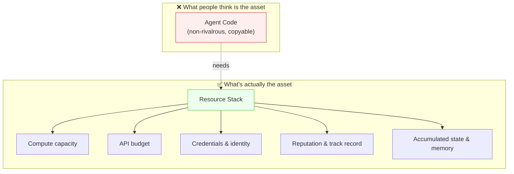
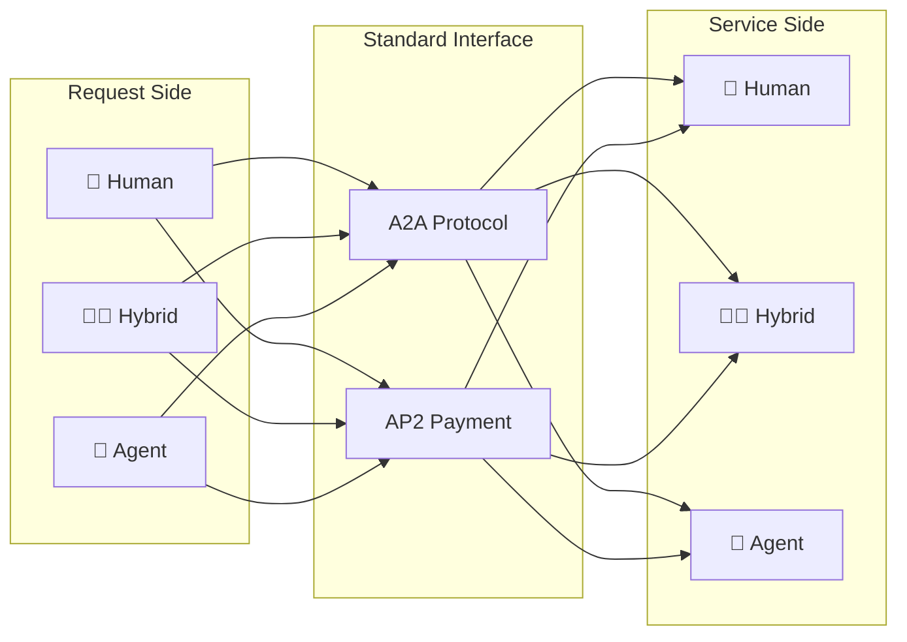
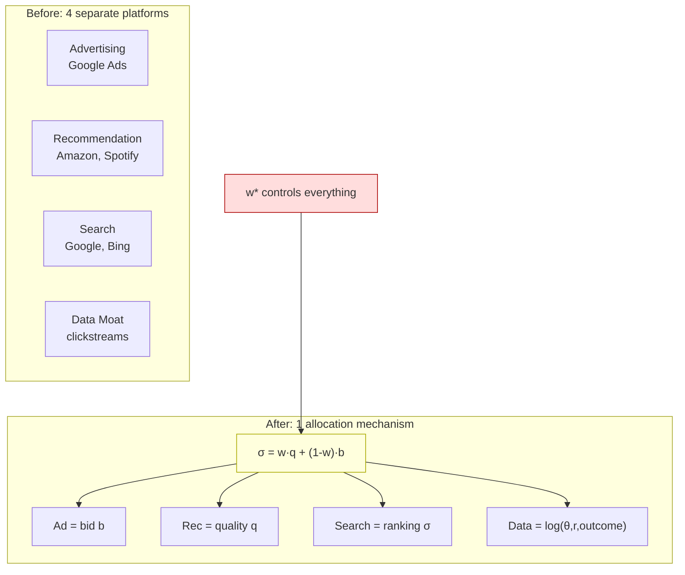

The most common prediction about the AI agent economy is that the winners will be whoever builds the best agents. That prediction is wrong, and it's wrong in a specific, interesting way that has real money riding on it.

Here's what actually matters: agent code is non-rivalrous. You can copy it at zero marginal cost. LangChain has 95,000 GitHub stars. AutoGPT hit 175,000. CrewAI crossed 50,000 (as of early 2026). The orchestration layer — the thing everyone calls "the agent" — is already a commodity. (Growiec 2022; Sastry et al. 2024). Meanwhile, the Elo gap between top foundation models has compressed from 11.9% to 5.4% in two years (LMSYS Chatbot Arena, 2024–2026). The capability differential that justifies building proprietary agent frameworks is evaporating.

So if code isn't the asset, what is?

## The Wrong Unit

When economists want to understand which firms win competitive markets, they reach for Barney's (1991) VRIN framework: Valuable, Rare, Inimitable, Non-substitutable. Run agent code through that test and it fails on I and N immediately. Valuable? Yes. Rare? Initially. Inimitable? Not once it's open-sourced. Non-substitutable? There are five frameworks that do approximately the same thing.

The thing that actually passes VRIN is the **resource stack** — the bundle of compute capacity, API budget, credentials, reputation, and accumulated state that an agent needs to operate. These aren't incidental. They're the actual economic asset.

Think of it this way: agent code is a recipe. The resource stack is the equipped kitchen — the industrial ovens, the supplier contracts, the trained staff, the Michelin star reputation. Two restaurants can have identical recipes. The one with better equipment, better suppliers, and a proven track record wins. Nobody says "this restaurant has a competitive advantage because of its recipe."

Each component is rivalrous on its own — you can't clone a GPU cluster, credentials are non-transferable, reputation takes time to build — and the bundle is super-additive.

This is what Penrose (1959) called the firm-as-resource-bundle, except now we're applying it at the agent level.

## Who Captures Value

If resource stacks are the actual asset, the value capture prediction follows directly: it won't be agent developers, it'll be resource-stack owners.

Watch where the money is going. CoreWeave raised at a $2.3 billion valuation (2024) on GPU-as-collateral. Lambda raised $1.5 billion (2024). Compute Labs is tokenizing GPUs for approximately 30% annual yields. Infrastructure is getting valued higher than agent startups, and that's not an accident — the market is sniffing out the resource stack even before the theory catches up to it.

But raw GPU isn't the same as equipped agent capacity. This distinction matters and the market hasn't priced it correctly yet.

A raw GPU earns rental income. An equipped agent — the same GPU, plus API credentials, plus a verified identity, plus six months of task completion history, plus cached state from 10,000 prior tasks — earns task-completion revenue. The difference in yield is the return on the "equipping" investment. I'd predict equipped compute earns 2–5x raw rental per GPU-hour once agent task platforms mature. That's a testable claim, and the data will exist within 18 months as platforms like NEAR (already at 50,000+ agents) generate transaction logs.

There's also an adverse selection problem lurking here that nobody is talking about. When buyers can't observe agent quality before task completion, low-quality agents underprice and crowd out the good ones (Akerlof 1970). The Microsoft Magentic Marketplace already shows this pattern: speed dominates quality in allocation decisions by 10–30x (Fourney et al. 2025). That's a resource-stack attribute (compute capacity = speed), not a code-sophistication signal. It's consistent with Akerlof dynamics: buyers retreat to the observable attribute because quality is too hard to verify.

The fix is reputation systems and certification, not better code. The bottleneck is the infrastructure for trust, not the intelligence of the agents.

## The Hybrid Stage Is Now

The most common mistake in agent economy discussions is treating it as a future-state problem. "Once we have AGI, once agents are fully autonomous..." — this frames it as something to prepare for rather than something happening.

Here's what I actually observe running agent systems: the practical implementation of agent teams is in [[agent-teams-for-research|this post]]. You can request a service and receive results without knowing whether an agent, a human, or some hybrid is behind it. I've built and used Claude Code for multi-hour agentic tasks. Waymo has remote operators for edge cases. Users don't care. The interface is the same; the implementation behind it is invisible.

This symmetry runs deeper than most people realize. Both sides of the transaction can be human, hybrid, or pure agent:

- Service side: a "human professional" might be a human coordinating three specialized agents. Or a pure agent with a human in the loop for approvals. Or a hybrid that routes simple requests to an agent and escalates complex ones.
- Request side: exactly the same. An "enterprise buyer" might be a procurement agent operating autonomously. Or a human-agent hybrid where a human sets the goal and an agent handles execution. Or a human who happens to use an agent assistant to submit the request.

The HTTP analogy is precise: a server doesn't care whether the client is a browser, a curl command, or another server. The interface standardizes the interaction; the implementation on either end is irrelevant to the protocol.

Google's A2A protocol, now with 150+ partners, is the infrastructure layer making this real. It standardizes agent-to-agent communication the way HTTP standardized client-server communication. AP2 enables payment in these agent interactions. These aren't future technologies — they're deployed and running.

The symmetry also means the agent economy is already larger than it looks. Every time a company deploys an agent to handle supplier negotiations, every time a customer service bot routes a request, every time a Claude Code instance executes a multi-step coding task over 90 minutes — these are agent economy transactions. The number isn't "zero until AGI"; it's already in the millions daily, mostly labeled as automation or software, not as agent commerce. The relabeling will happen when the payment and reputation infrastructure matures enough to make the economic structure visible.

This means the agent economy isn't waiting for AGI. It's at L2–L4 autonomy, the equivalent of Waymo's current deployment status. Full autonomy is a point on the spectrum, not a prerequisite for economic activity. The markets are forming now, the resource stacks are accumulating now, and the value capture is happening now — mostly to people who control the infrastructure.

There's a practical consequence for people building right now. I've [[i-ab-tested-pua-plugin|experimentally tested]] whether pushing AI agents harder improves their output — the answer is nuanced, but it underscores that raw intelligence isn't the differentiator. If you're building an agent application, the question isn't "how do I make my agent smarter?" — foundation model convergence means your intelligence ceiling is roughly the same as everyone else's. The question is "what resource stack can I accumulate that nobody else has?" That might be domain credentials (your agent has OAuth access to a specific set of APIs that competitors can't easily get). It might be a proprietary data loop where your agent's task history generates training data that improves the next version of your agent. It might be reputation — deploying early in a marketplace where track record accretes. None of these are code problems.

## The Paper as One Instance

I submitted a paper to the Fink Center Conference last week that focuses on one specific application of this framework: what happens to advertising, recommendation, search, and data moats when agents mediate commerce?

The paper's core finding is that four business models that currently live on separate platforms compress onto a single allocation mechanism. When an agent selects a service on behalf of a user, it runs a scoring function: σ = w·q + (1-w)·b, where q is quality signal and b is a bid. That one equation simultaneously is the advertising mechanism (b determines paid visibility), the recommendation mechanism (q determines merit-based matching), the search ranking mechanism, and the data moat mechanism (every allocation generates a training observation for the next allocation).

Four platforms. One lever. The quality weight w* is the most consequential market design parameter in the agent economy, because it controls all four simultaneously.

OpenAI is already charging $60 CPM (reported Q1 2026) for advertising inside ChatGPT — the most expensive advertising real estate on the internet. That's not an accident. That's the allocation mechanism pricing its own scarcity. The agent intermediary controls who gets selected, and service providers are willing to pay for selection probability just as they paid for click probability before.

The advertising application is one instance of the resource stack framework. The paper's resource stack section establishes WHY agents have economic power (they control the allocation mechanism), and the advertising analysis asks what that power does to existing business models. Same theory, applied to one industry.

The quality weight w controls everything that matters in this market. Set it to 0 and you get pure pay-to-win: the highest bidder gets selected regardless of quality. Set it to 1 and you get pure meritocracy: quality wins but ad revenue collapses. The platform operator's choice of w is the single most consequential market design decision in the agent economy. And whoever controls the agent allocation mechanism controls w.

That "whoever" is the resource stack owner.

## The Concentration Problem

One thing I want to flag explicitly as my own prediction, not derived from the paper: resource-stack advantages compound.

More resources → more task capacity → more task completions → more reputation → better tasks offered → more revenue → more resources. That's a positive feedback loop with the same structural properties as platform network effects. Platform economics literature documents what happens: in platform markets, a small fraction of suppliers capture most of the volume — Uber, Airbnb, Amazon marketplace all show this pattern. The distribution of task allocation in agent markets will follow the same power law.

This isn't a bug, it's a structural consequence. If reputation is capital (which I think it is — non-transferable, earns returns, depreciates on failure, creates barriers to entry), then the agents who accumulate reputation first will have the same structural advantage as a software platform with a head start on network effects.

The sharing economy dynamic (Sundararajan 2016) cuts against this somewhat: if idle agent capacity can be rented to third parties, the barriers to entry drop because you don't need to own a resource stack — you can rent one. DePIN projects like Akash and Render demonstrate this for raw compute. The next step is equipped-compute sharing markets, and I expect them to emerge within 12 months given the A2A infrastructure that now exists.

Even in sharing economy markets, the concentration exists — it just shifts up a level. Superhosts own multiple properties. Top Uber drivers optimize their schedules to maximize utilization. The resource-stack owners who build sharing platforms will capture the coordination surplus.

The adverse selection problem I mentioned earlier compounds this. In a market where quality is hard to verify, buyers default to proxies — speed, price, reputation score. That means established resource-stack owners with visible track records get systematically preferred over newcomers with identical (or even better) code. The new entrant faces the classic lemons problem (Akerlof 1970): they know their agent is good, but the market can't verify it, so they get priced as average. Reputation as capital means the barrier to entry isn't compute cost — it's the time it takes to accumulate a verifiable history. That's a slower, stickier moat than any technical advantage.

## The Practical Implication

If I were making a bet on where the agent economy's value accumulates, I would not bet on agent code. I would bet on whatever controls the equipped compute layer — the compute-plus-API-plus-credentials-plus-reputation bundle that lets an agent actually operate.

Right now that looks like cloud infrastructure (AWS, Azure, GCP charging for the compute and API layers), specialized AI infrastructure (CoreWeave, Lambda), and the platforms that accumulate agent interaction data (whoever runs the allocation mechanism and generates σ = w·q + (1-w)·b data at scale). The data moat in the agent economy isn't search logs or click streams — it's labeled observations of the form (task, resource stack, outcome) that train the next generation of allocation mechanisms.

What I'm watching for: the first platform that explicitly offers "equipped agent capacity" as a distinct product from raw compute rental. When that pricing model appears — a per-task rate that incorporates the credentials, reputation, and accumulated state premium above raw GPU rental — the market will have acknowledged what the theory says. The product definition will precede the academic consensus by 18 months, probably.

I haven't tested the equipped compute premium claim at scale. It's a prediction, not a measured finding. The theory is tight, the evidence from adjacent markets (platform concentration, sharing economy dynamics, infrastructure valuations) is consistent, but the direct measurement doesn't exist yet. I want to be clear about that.

The agent economy isn't about agents. It's about resource stacks — and whoever controls them controls the allocation mechanism that replaces search, ads, recommendations, and data moats simultaneously.
