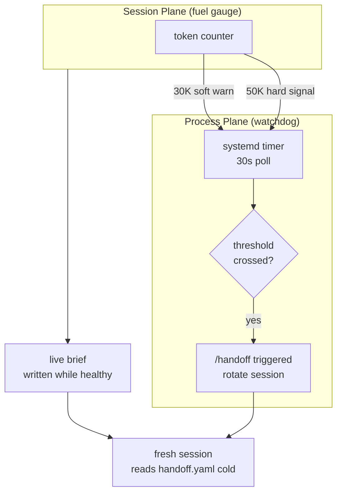

# The Watchdog Outside the Model: A Two-Plane Architecture for Context Rotation

The session started healthy. Clean tool calls, accurate file paths, no hallucinations. Then, somewhere around turn 40, the model started confidently citing a path that didn't exist. Not a guess — it cited it three times in a row, with the tone of someone who had checked. The file had existed earlier in the session, been deleted, and the model hadn't noticed.

Restarting worked. Immediately. Same task, fresh session, solved in two tool calls.

I'd seen this before. The pattern is documented in [[context-degradation-theory]] and [[context-degradation-production]]: degradation is driven by absolute token count, not context window percentage. By the time a session hits the 30-50K token range, attention has spread so thin that the model is operating like a junior developer who lost the thread. It fixes symptoms locally, can't see the global picture, and reports outdated state with full confidence.

The question that took longer to answer: once you understand the mechanism, what do you actually do about it?

The naive answer is "better prompts" or "smaller context." The right answer is that the model is the degrading component, and the fix has to live outside it.

---

## The Wrong Mental Model

Context management advice usually treats the model as the thing you tune: longer context windows, better compression, smarter system prompts, more explicit instructions about what to remember. All of these help at the margins. None of them solve the underlying problem.

The softmax dilution Nakanishi (2025) describes in arXiv:2510.05381 isn't a configuration issue. Adding blank whitespace tokens to a context window — tokens with literally zero information content — still degrades performance by 13.9-85% just from the absolute length increase. The mechanism doesn't care how carefully you crafted your instructions. The denominator of the softmax operation gets larger, each token's attention share shrinks, and eventually the model loses fidelity to things it read hundreds of tokens ago.

Position encoding OOD (where absolute positions seen at inference exceed the training distribution, causing RoPE and similar schemes to extrapolate outside their trained range; Su et al., 2024, Neurocomputing 568:127063, doi:10.1016/j.neucom.2023.127063) and the Lost-in-the-Middle U-curve (Liu et al., 2023, arXiv:2307.03172) compound this. By 50K tokens, you're stacking three independent degradation mechanisms on top of each other.

The upshot: this is not a model quality problem with a model quality fix. It's a resource management problem. The right analogy isn't "tune the instrument" — it's "rotate the shift."

A surgeon doesn't work a 30-hour shift because they're less effective after 12. Landrigan et al. (2004, NEJM 351:1838-48, doi:10.1056/NEJMoa041406) found that interns on traditional extended-shift schedules made 35.9% more serious medical errors than those on reduced-hour schedules. The quality loss is invisible to the surgeon experiencing it. You need a system outside the surgeon to enforce the rotation.

---

## Two Planes, One Mechanism

The architecture I arrived at splits responsibilities across two planes:

**Process plane** (the watchdog): sits outside any individual session. Knows that sessions degrade and enforces rotation. Monitors context utilization, triggers handoffs, restarts sessions. The watchdog operates at system level — it cannot be confused or hallucinated by the model it monitors.

**Session plane** (the fuel gauge): operates inside the session. Measures context freshness in absolute tokens, not percentage of window. Fires warnings when the session is still healthy enough to write a useful handoff.

The key insight is the asymmetry: the session plane measures the problem while it's still fixable, and the process plane acts on the measurement from outside the degrading system.

---

## How the Process Plane Works

The `claude-op` repository (now git-archived as of 2026-04-16) captured the first working version of this. `cc-hub.sh` ran in a tmux session on a GPU server with a systemd watchdog timer set to 30-second polling intervals. The watchdog checked `/tmp/cc-context-pct`, a file written by `~/.claude/scripts/statusline.sh` on every CC turn. When context crossed 20% of window, it sent a nudge. At 30%, it forced `/handoff` and rotated to a fresh session.

I was wrong about those thresholds. The original architecture used percentage-of-window because that was the prevailing heuristic: stay under 20%, nudge at 30%. It broke empirically. Sessions at 3% of a 1M-token window were degrading just as badly as sessions at 40% of a 20K window, because both had accumulated ~50K absolute tokens. `feedback_absolute-token-threshold.md` is where I worked through the correction: the right threshold is 30K absolute tokens (soft warning) and 50K (hard rotation), regardless of window size. The three mechanisms (softmax dilution, Lost-in-the-Middle U-curve, position encoding OOD) all scale with absolute length, not ratio. Percentage thresholds are measuring the wrong thing.

The watchdog doesn't know anything about what the session was doing. It doesn't read the session transcript. It reads one number from one file and compares it to a threshold. This is by design. The enforcer must not share the degrading state it's enforcing against.

---

## The Handoff Fidelity Problem

Rotating sessions doesn't help if the handoff is written by the degraded session.

This is the failure mode `prds/cc-live-brief-v0.md` was designed to solve. The current `claude-op` approach (`/handoff` at session end) has a structural flaw: the model that writes the handoff is the most degraded version of the model in that session. Whatever context fragmentation, stale state, and attention scatter accumulated, all of it is active when the handoff is written. The worst model writes the most important summary.

cc-live-brief inverts this. Instead of writing the handoff at session end, a Stop hook fires a detached background agent after every turn: `nohup bash -c '...' &` plus `disown`, the macOS-compatible substitute for `setsid` (Linux-only). This background agent runs `claude -p` in a fresh context, reads the last N turns of the session transcript as a delta, and updates a live YAML brief. I verified phases 0 and 1 in session 37 (2026-04-07): Stop hooks fire on every turn, detachment works cross-platform, foreground session lag is below perceptible threshold.

The model that reads the delta is stateless. It reads 10 turns of clean transcript with no accumulated scatter. By the time the session ends and the watchdog triggers rotation, the live brief already contains a fresh-context summary of everything that happened. The new session reads it cold. No cold-start tax.

---

## Why Hooks Don't Degrade

There's a second mechanism at work here, which `feedback_hook-as-degradation-hedge.md` captures directly.

Enforcement hooks in CC operate at system level. They read tool inputs and outputs as structured JSON and apply deterministic bash checks: banned patterns, missing required fields, file existence, exit codes. These checks do not involve the model. They cannot be confused by attention scatter or position OOD. They work identically at turn 1 and turn 200.

The ablation study in `enforcement-hooks-ablation.md` (12 runs, 6 scenarios, 2026-04-10) found 83% divergence between hook-on and hook-off agent outcomes. The mechanisms tracked by hooks (whether the agent used the skill-routing pipeline, whether it wrote a formal diagnosis before editing code) followed completely different paths depending on whether the hook was present. The model without the hook didn't lack the ability; it lacked the external pressure to invoke it.

Hook hot-reload behavior matters here. `feedback_stop-hook-hot-reload.md` documents that Stop hooks and PostToolUse hooks reload mid-session when `settings.json` is edited, while PreToolUse hooks cache at startup and require a session restart. This means the live brief writer (a Stop hook) can be added or updated mid-session without disruption. The hook that monitors the degrading session is immune to whatever is degrading it.

Any enforcement mechanism that operates outside the model's inference path is immune to context degradation. Exit-2 hooks, watchdog scripts, systemd timers — all are deterministic processes that cannot be hallucinated away. The model can forget what it's supposed to do. The hook doesn't forget.

---

## What This Pattern Is Not

This is not a model-side fix. Better prompts ("remember to write accurate file paths") and longer context windows both fail for the same reason: they don't address softmax dilution. The prompt competes for attention against everything else accumulated in context, and arXiv:2510.05381 showed that a 10M window performs no better than a smaller one once absolute token count crosses the 30-50K threshold. Liu et al. (2024, TACL 12:157-173, doi:10.1162/tacl_a_00638) confirmed the same U-curve degradation pattern holds across model sizes and window configurations. The mechanism doesn't care how carefully you crafted your instructions.

This is not compression or summarization. CC's auto-compaction reduces context window utilization, which helps at the margins. But compaction is reactive — it fires after accumulation has already occurred — and it's lossy by design. The live brief approach is preventive and verbatim.

What this is: the same pattern that Jenkins implements for build systems, that Kubernetes implements for container health, that database replication implements for read scaling. Measure the degrading resource from outside. Enforce rotation at threshold. Seed the fresh instance from a healthy snapshot. The pattern has a name in each of those communities. For AI agents running long sessions, it doesn't have a canonical name yet. "Watchdog-driven context rotation" is a start.

---

## The Takeaway

The session that hallucinates file paths isn't broken. It's just overdue for rotation. The fix isn't inside the model; it's the system that monitors the model's health from outside and rotates it before the degradation becomes visible to the user. The live brief, written turn by turn while the session is still healthy, is what makes the rotation seamless rather than painful.

Building this took two repos, a GPU server, and a few dozen sessions of empirical debugging. The architecture turned out to be less exotic than it looked: a watchdog, a fuel gauge, and a background writer. The same shape as every other resource lifecycle management problem, just applied to an LLM session instead of a database connection.
