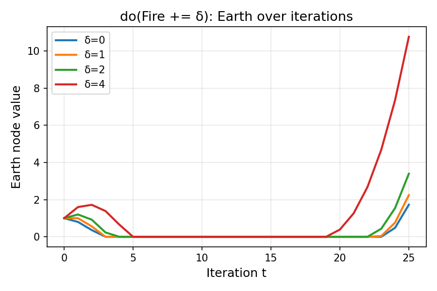
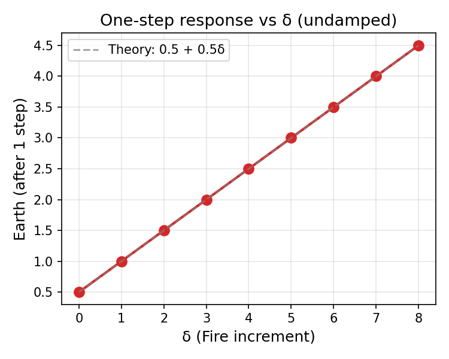

# 用图神经网络的视角理解五行：一个形式化框架

我一直觉得五行是玄学——不是坏意思，只是觉得它和我日常用的那套语言（矩阵、图、消息传递）属于两个不同的宇宙。直到有一天，一个朋友让我帮他"算一算"他的八字，我下意识地开始画图：5个节点，有向边，信息沿边传播……

等等，这不就是 GNN 吗？

这篇文章是我试图用形式化方法理解一个符号系统的记录（这种"跨领域翻译"的冲动和 [[from-tcp-to-sigmoid-a-journey-of-odds|从 TCP 到 Sigmoid]] 那篇是同一条学习弧线）——不是要证明五行是科学，而是看它的内部逻辑能走多远。最后的结论比我预期的更有趣：让我惊讶的不是模型本身，而是建模这件事暴露出来的一个更普遍的问题。

> 声明：这是符号系统的形式化建模，不是可验证的生理因果模型。

---

## 两套语言，一个张力

在我展示数学之前，先说我最想说的事。

把五行数学化之后，我发现自己陷入了一个奇怪的处境：

一开始用叙事方式理解这个系统——高山的土、很多水、不断生长的树。然后我把它压缩成矩阵和图，变成一个可计算的传播模型。模型更精确了，却也更干巴了。之前那种整体的画面感，在方程上讲不出来。

| | 叙事解释 | 结构模型 |
|---|----------------|----------------|
| 语言 | "高山阳土，水多木旺，土被消耗" | $h^{(t+1)} = h^{(t)} + \lambda_g A_g^\top h^{(t)}$ |
| 优点 | 有温度，有整体感，贴近人的经验 | 可计算，可推演，可做干预实验 |
| 缺点 | 不可量化，难做局部因果拆解 | 失去整体故事，冷、抽象、局部 |

真正让这件事"有意义"的，不是模型本身，而是能在**模型语言**和**人类经验语言**之间来回翻译的那一刻。

大多数人停在两个极端：只会讲故事不会建模，或者只会建模不会解释。真正有力量的，是同时拥有两套语言——一套对变量说话，一套对人说话。

我把这两种能力分别叫 DS（Data Science：变量、结构、可计算）和 ADS（Applied Data Storytelling：意义、直觉、可理解）。也许数据科学真正落地的地方，不只是 DS，而是 DS + ADS——让数据结构重新变回人能理解的世界。

好，现在来看数学。

---

## 数学模型

### 从四柱到 5×4 分布矩阵

四柱（年/月/日/时）的 8 个位置映射到五行 [木, 火, 土, 金, 水]。

以 **癸酉 / 壬子 / 戊寅 / 癸亥** 为例：

| 柱 | 天干 | 地支 | 五行分布 |
|----|------|------|----------|
| 年 | 癸（水） | 酉（金） | 水1, 金1 |
| 月 | 壬（水） | 子（水） | 水2 |
| 日 | 戊（土） | 寅（木） | 土1, 木1 |
| 时 | 癸（水） | 亥（水） | 水2 |

> 注：以下八字为虚构示例，仅用于演示建模方法。

构建分布矩阵 $X \in \mathbb{R}^{5 \times 4}$：

$$
X = \begin{bmatrix}
0 & 0 & 1 & 0 \\
0 & 0 & 0 & 0 \\
0 & 0 & 1 & 0 \\
1 & 0 & 0 & 0 \\
1 & 2 & 0 & 2
\end{bmatrix}
$$

行顺序：[木, 火, 土, 金, 水]，列顺序：[年, 月, 日, 时]。

引入层级权重 $w \in \mathbb{R}^4$，例如强调月柱：

$$
w = \begin{bmatrix} 1 \\ 2 \\ 1 \\ 1 \end{bmatrix}
$$

汇总得到五行强度向量：

$$
s = Xw = [1, 0, 1, 1, 7]^\top
$$

日干是戊土，因此主节点 $r = \text{土}$。

### 相生与相克的邻接矩阵

**相生**（行生列）：木 → 火 → 土 → 金 → 水 → 木

$$
A^{(gen)} = \begin{bmatrix}
0 & 1 & 0 & 0 & 0 \\
0 & 0 & 1 & 0 & 0 \\
0 & 0 & 0 & 1 & 0 \\
0 & 0 & 0 & 0 & 1 \\
1 & 0 & 0 & 0 & 0
\end{bmatrix}
$$

**相克**（行克列）：木 → 土, 土 → 水, 水 → 火, 火 → 金, 金 → 木

$$
A^{(ctl)} = \begin{bmatrix}
0 & 0 & 1 & 0 & 0 \\
0 & 0 & 0 & 1 & 0 \\
0 & 0 & 0 & 0 & 1 \\
1 & 0 & 0 & 0 & 0 \\
0 & 1 & 0 & 0 & 0
\end{bmatrix}
$$

### 消息传播更新

把它建模为类 GNN 的消息传递：相生加分，相克减分。

$$
h^{(t+1)} = h^{(t)} + \lambda_g (A^{(gen)})^\top h^{(t)} - \lambda_c (A^{(ctl)})^\top h^{(t)}
$$

取 $\lambda_g = \lambda_c = 0.5$，初始 $h^{(0)} = s$。

### 干预实验：do(火 += δ)

定义外源火输入 $\delta \geq 0$：

$$
h^{(0)}(\delta) = [1, \delta, 1, 1, 7]^\top
$$

一步传播后的闭式解：

$$
h^{(1)}(\delta) = \big[4, \delta - 3, 0.5 + 0.5\delta, 1.5 - 0.5\delta, 7\big]^\top
$$

关键是土节点：

$$
h^{(1)}_{\text{土}}(\delta) = 0.5 + 0.5\delta
$$

加一点火，土在一步传播后线性回升——这是"火生土"的结构效应。斜率 0.5 表示每增加 1 单位火，土增加 0.5 单位。

### 稳定化处理

纯线性循环图容易振荡。加两个简单的稳定化：

**阻尼衰减**：

$$
h^{(t+1)} = (1 - \rho) h^{(t)} + \rho \Big( h^{(t)} + \lambda_g A_g^\top h^{(t)} - \lambda_c A_c^\top h^{(t)} \Big)
$$

**非负截断**（ReLU）：

$$
h^{(t+1)} \leftarrow \max(h^{(t+1)}, 0)
$$

---

## 实验代码

```python
import numpy as np
import matplotlib.pyplot as plt

# Order: [Wood, Fire, Earth, Metal, Water]
WOOD, FIRE, EARTH, METAL, WATER = range(5)

def build_example_X():
    X = np.zeros((5, 4), dtype=float)
    # Year: 癸酉 = Water + Metal
    X[WATER, 0] += 1
    X[METAL, 0] += 1
    # Month: 壬子 = Water + Water
    X[WATER, 1] += 2
    # Day: 戊寅 = Earth + Wood
    X[EARTH, 2] += 1
    X[WOOD, 2] += 1
    # Hour: 癸亥 = Water + Water
    X[WATER, 3] += 2
    return X

def build_graph_matrices():
    A_gen = np.zeros((5, 5), dtype=float)
    A_gen[WOOD, FIRE] = 1
    A_gen[FIRE, EARTH] = 1
    A_gen[EARTH, METAL] = 1
    A_gen[METAL, WATER] = 1
    A_gen[WATER, WOOD] = 1

    A_ctl = np.zeros((5, 5), dtype=float)
    A_ctl[WOOD, EARTH] = 1
    A_ctl[EARTH, WATER] = 1
    A_ctl[WATER, FIRE] = 1
    A_ctl[FIRE, METAL] = 1
    A_ctl[METAL, WOOD] = 1
    return A_gen, A_ctl

def step(h, A_gen, A_ctl, lam_g=0.5, lam_c=0.5, rho=0.5, relu=True):
    msg = h + lam_g * (A_gen.T @ h) - lam_c * (A_ctl.T @ h)
    h_next = (1 - rho) * h + rho * msg
    if relu:
        h_next = np.maximum(h_next, 0.0)
    return h_next

def rollout(h0, A_gen, A_ctl, T=20, **kwargs):
    hs = [h0.copy()]
    h = h0.copy()
    for _ in range(T):
        h = step(h, A_gen, A_ctl, **kwargs)
        hs.append(h.copy())
    return np.array(hs)

# Build X and s
X = build_example_X()
w = np.array([1, 2, 1, 1], dtype=float)
s = X @ w

# Build graph matrices
A_gen, A_ctl = build_graph_matrices()

# Intervention: do(Fire += delta)
def intervene_fire(s, delta):
    h0 = s.copy()
    h0[FIRE] += float(delta)
    return h0

# Compare trajectories
deltas = [0, 1, 2, 4]
T = 25
trajectories = {}
for d in deltas:
    h0 = intervene_fire(s, d)
    hs = rollout(h0, A_gen, A_ctl, T=T, lam_g=0.5, lam_c=0.5, rho=0.4, relu=True)
    trajectories[d] = hs

# Plot Earth node over time
plt.figure()
for d, hs in trajectories.items():
    plt.plot(hs[:, EARTH], label=f"delta={d}")
plt.xlabel("Iteration t")
plt.ylabel("Earth node value")
plt.title("do(Fire += delta): Earth over iterations")
plt.legend()
plt.savefig("earth_trajectory.png", dpi=150)
plt.show()
```

---

## 实验结果

### 图 1：土节点随迭代的变化



- δ=0（无干预）：土先下降后缓慢回升
- δ 越大，土恢复越快，后期增长越陡
- 初始下降是因为木克土、水克火的连锁效应

### 图 2：一步响应 vs δ



- 完美线性关系，与闭式解 $h^{(1)}_{\text{土}}(\delta) = 0.5 + 0.5\delta$ 吻合
- 验证了"火生土"在这个形式化框架中的结构效应

---

## 我没想到的：压缩率

做完这个模型之后，最让我意外的不是"火生土"成立——那是预设的结构，不会不成立。

让我停下来想了很久的，是这个数字：**5 个节点，10 条边，编码了一个名义上有 2 亿种可能的系统。**

理论上，四柱每柱有 10 天干 × 12 地支 = 120 种，四柱组合约 2 亿种。

但实际有约束：
1. **干支配对规则**：阳干配阳支、阴干配阴支 → 每柱只有 60 种组合（六十甲子）
2. **月干由年干决定**：月柱自由度只有 12（月支）
3. **时干由日干决定**：时柱自由度只有 12（时支）

有效组合：

$$
60_{\text{年}} \times 12_{\text{月}} \times 60_{\text{日}} \times 12_{\text{时}} = 518{,}400 \approx 52\text{万}
$$

从 52 万到 5，中间是这三步：

| 步骤 | 操作 | 效果 |
|------|------|------|
| ① 类别归并 | 22 种符号 → 5 种五行 | 语义聚类 |
| ② 权重聚合 | 5×4 矩阵 → 5 维向量 | $s = Xw$ |
| ③ 结构先验 | 加入固定生克图 | 约束推理空间 |

这不是玄学，这是信息论。五行的"相生相克"图结构，本质上是用 10 条有方向的边，把 22 个符号的关系压缩成一套可传播的规则。这种归纳偏置，和 GNN 里的图结构先验在逻辑上是同一件事。

这个压缩还有一个微妙的权力维度：**谁定义抽象框架，谁就定义了什么是"合理解释"**。当框架被完全暴露出来——矩阵、图、更新规则——人就获得了理解能力，而不是依赖解释者。这篇文章想做的，就是这件事。

---

## 局限与声明

1. 这是**符号系统的形式化**，不是可验证的因果模型
2. 权重 $w$ 是超参数，可以做敏感性分析
3. 传统命理有更复杂的规则（十神、大运、流年），本模型只是简化演示

---

## 参考

- 消息传递神经网络（MPNN）: Gilmer et al., 2017
- 五行生克基础：《子平真诠》《滴天髓》
- 表示学习与归纳偏置：Bengio et al., "Representation Learning: A Review and New Perspectives", 2013

---

## 在线体验

→ **[计算人文 Demo](https://wuxing-demo-4o4bbkotav4uwjdasqwlb9.streamlit.app/?tab=lab)** — 交互式探索压缩过程与干预实验

→ **[GitHub Repo](https://github.com/zl190/wuxing-demo)** — 完整代码

*用现代框架解构传统系统*
